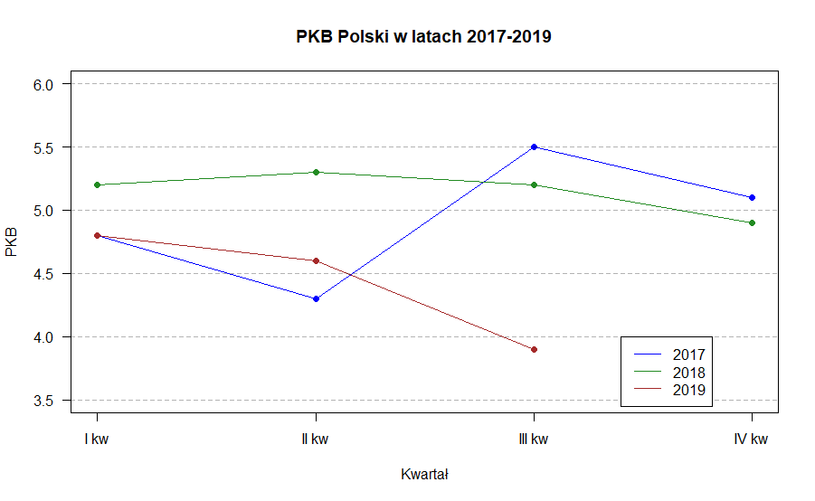

<style type="text/css">
.title {
  display: none;
}

.table {
    width:70%;
}

#getting-started img {
  margin-right: 10px;
}

</style>


# Legenda

Kolejnym elementem do umieszczenia jest legenda. Używamy funkcji `legend` - [link](https://www.rdocumentation.org/packages/graphics/versions/3.5.1/topics/legend).


```{r}
x <- seq(-2*pi,2*pi,0.1)
plot(x, sin(x),ylab="",type="l",col="blue")
lines(x,cos(x), col="red")
legend("topleft",c("sin(x)","cos(x)"),fill=c("blue","red"))
```


Mozna też określić współrzędne. Ale musimy być ostrożni, aby nie wypaść poza obszar wykresu. 

```{r}
x <- seq(-2*pi,2*pi,0.1)
plot(x, sin(x),ylab="",type="l",col="blue")
lines(x,cos(x), col="red")
legend(0.5,0.2,c("sin(x)","cos(x)"),fill=c("blue","red"))
```

Inne przykłady:

```{r}
x<-1:10; y1=x*x; y2=2*y1
plot(x, y1, type="b", pch=19, col="red", xlab="x", ylab="y")
lines(x, y2, pch=18, col="blue", type="b", lty=2)
legend(1, 95, legend=c("Line 1", "Line 2"),
       col=c("red", "blue"), lty=1:2, cex=0.8)
```

```{r}
x<-1:10; y1=x*x; y2=2*y1
plot(x, y1, type="b", pch=19, col="red", xlab="x", ylab="y")
lines(x, y2, pch=18, col="blue", type="b", lty=2)
legend(1, 95, legend=c("Line 1", "Line 2"),
       col=c("red", "blue"), lty=1:2, cex=0.8,
       title="Line types", text.font=4, bg='lightblue')
```

```{r}
x<-1:10; y1=x*x; y2=2*y1
plot(x, y1, type="b", pch=19, col="red", xlab="x", ylab="y")
lines(x, y2, pch=18, col="blue", type="b", lty=2)
legend(1, 95, legend=c("Line 1", "Line 2"),
       col=c("red", "blue"), lty=1:2, cex=0.8,
       box.lty=2, box.lwd=2, box.col="green")
```

```{r}
x<-1:10; y1=x*x; y2=2*y1
plot(x, y1, type="b", pch=19, col="red", xlab="x", ylab="y")
lines(x, y2, pch=18, col="blue", type="b", lty=2)
legend(1, 95, legend=c("Line 1", "Line 2"),
       col=c("red", "blue"), lty=1:2, cex=0.8,
       box.lty=0)
```

Przykład na "przyszłość" - horyzontalne rozłożenie w legendzie.

```{r}
boxplot(mtcars$mpg~mtcars$cyl, 
        xlab="Cylinders", ylab="Miles/(US) gallon", 
        col=topo.colors(3))
   
legend("bottomleft", inset=.02, title="Number of Cylinders",
   c("4","6","8"), fill=topo.colors(3), horiz=TRUE, cex=0.8)
```

Ćwiczenie. Spróbuj odzworować poniższy wykres. Dane są w pliku pbb.xlsx.
http://wmii.uwm.edu.pl/~piojas/wp-content/uploads/2020/02/pkb.xlsx



Pomocna może być funkcja `abline` - http://www.sthda.com/english/wiki/abline-r-function-an-easy-way-to-add-straight-lines-to-a-plot-using-r-software
