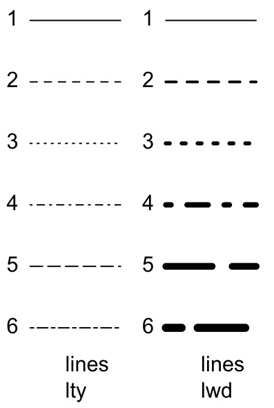

<style type="text/css">
.title {
  display: none;
}

.table {
    width:70%;
}

#getting-started img {
  margin-right: 10px;
}

</style>


# Dodatkowe linie

Aby dorysować linię, mamy funkcję `lines' - [link](https://www.rdocumentation.org/packages/graphics/versions/3.5.1/topics/lines).

Objaśnienie symboli `pch` - [link](http://www.sthda.com/english/wiki/r-plot-pch-symbols-the-different-point-shapes-available-in-r).

Objaśnienie symboli `lty` - [link](http://www.sthda.com/english/wiki/line-types-in-r-lty).



```{r}
x <- seq(-2*pi,2*pi,0.1)
plot(x, sin(x), type="l")
lines(x,cos(x), type="o", pch=22, lty=2,col="red")
```
```{r}
x <- seq(-2*pi,2*pi,0.1)
plot(x, sin(x), type="l", lwd=3)
lines(x,-cos(x), type="o", pch=22, lty=2,col="red")
```

Możemy rysować więcej linii:
```{r}
x <- seq(-2*pi,2*pi,0.1)
plot(x, sin(x), type="l")
lines(x,cos(x), type="o", pch=22, lty=2,col="red")
lines(x,rep(-0.5,length(x)), type="l", col="blue")
```