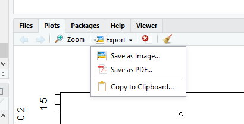

<style type="text/css">
.title {
  display: none;
}

.table {
    width:70%;
}

#getting-started img {
  margin-right: 10px;
}

</style>


# Parametry strony


## Marginesy

Ogólna koncepcja: 

```{r}
par()
```

Opisy parametrów są opisane w dokumentacji - [link](https://www.rdocumentation.org/packages/graphics/versions/3.5.1/topics/par).

```{r echo=FALSE}
old_par <- par(no.readonly = TRUE)

par(mar=c(5, 4, 3, 2))		# margins (between plot border and figure border)
par(oma=c(3, 3, 3, 3))		# outer margins (between outer border and figure border)
par(xpd=NA)					# show text and arrows outside plot region

par(xaxt = "n", yaxt = "n")	# do not draw axes

plot(0:10, 0:10, type="n", xlab=NA, ylab=NA)

box("plot", col="red3", lwd=2)
text(6.5, 0.05, "brzeg wykresu (plot border)", col="red3")

box("figure", col="blue4", lwd=2)
mtext("brzeg figury (figure border)", col="blue4", side=1, adj=1, line=3.6)

box("outer", col="green4", lwd=2)
mtext("zewnętrzny brzeg (outer border)", col="green4", side=1, adj=1.1, line=6.6)

text(5, 6.5, "obszar wykresu (plot region)", col="gray50", cex=1.5) 
arrows(-0.3, 5.5, 10.3, 5.5, code=3, col="gray50", lwd=1.5, lty=3)

mtext("obszar figury (figure region)", side=1, adj=0.5, line=2, col="gray50", cex=1.5)
arrows(-2.15, -1.6, 11.2, -1.6, code=3, col="gray50", lwd=1.5, lty=3)

mtext("obszar urządzenia (device region)", side=1, adj=0.5, line=5.7, col="gray50", cex=1.5)
arrows(-3.6, -5.8, 12.6, -5.8, code=3, col="gray50", lwd=1.5, lty=3)

par(old_par)
```

* `mar` - margines wyrażony w liczbie linii (interlinia?)
* `mai` - margines wyrażony w calach
* `oma` - zewnętrzny margines wyrażony w liczbie linii
* `omi` - zewnętrzny margines w calach

Kolejność parametrów: dół, lewo, góra, prawo.

Przykład dla kodu:
```{r results = 'hide'}
par(mar=c(5, 4, 3, 2))
par(oma=c(3, 3, 3, 3))
```

```{r echo=FALSE}
old_par <- par(no.readonly = TRUE)

par(mar=c(5, 4, 3, 2))		# margins (between plot border and figure border)
par(oma=c(3, 3, 3, 3))		# outer margins (between outer border and figure border)
par(xpd=NA)					# show text and arrows outside plot region

par(xaxt = "n", yaxt = "n")	# do not draw axes

plot(0:10, 0:10, type="n", xlab=NA, ylab=NA)

box("plot", col="red3", lwd=2)
text(8.5, 0.05, "brzeg wykresu", col="red3")

box("figure", col="blue4", lwd=2)
mtext("brzeg figury", col="blue4", side=1, adj=1, line=3.6)

box("outer", col="green4", lwd=2)
mtext("zewn. brzeg", col="green4", side=1, adj=1.1, line=6.6)

for (s in 1:4) {			# placement of text in margins
	for (i in 0:8) {
		mtext(paste("linia", i), col="gray50", side=s, adj=0.5, line=i)
	}
}

mtext("marignes", side=1, adj=0, line=2, col="gray50", cex=1.5)
mtext("zewn. margines", side=1, adj=0, line=6.4, col="gray50", cex=1.5)

par(old_par)
```

Zewnętrzny margines jest domyślnie ustawiony na zero. Przykłas użycia komendy `mar`.

```{r echo=FALSE}
old_par <- par(no.readonly = TRUE)

par(mar=c(7, 5, 6, 4))			# margins (between plot and figure borders)
par(xpd=NA)						# show text and arrows outside plot region								# set axis values, axis labels, and axis to gray
par(col.axis="gray50", col.lab="gray50", fg="gray50") 

plot(0:10, 0:10, type="n", xlab="etykieta osi x", ylab="etykieta osi y")

box("plot", col="red3", lwd=2)
text(9.1, 0.1, "brzeg wykresu", col="red3")

box("figure", col="blue4", lwd=2)
mtext("brzeg figury", col="blue4", side=1, adj=0.8, line=5.6)

box("outer", col="green4", lwd=2)
mtext("zewn. brzeg", col="green4", side=1, adj=1.15, line=5.6)

									# arrow annotations for margins
text(0.4, -2.4, "7 linii", col="skyblue3", cex=0.8)
arrows(1, -6.5, 1, -0.5, code=3, col="skyblue3", length=0.1)
text(0.4, 12.2, "6 linii", col="skyblue3", cex=0.8)
arrows(1, 10.5, 1, 15.75, code=3, col="skyblue3", length=0.1)
text(-1.5, 8.8, "5 linii", col="skyblue3", cex=0.8)
arrows(-0.5, 9.2, -2.4, 9.2, code=3, col="skyblue3", length=0.1)
text(11.2, 8.8, "4 linie", col="skyblue3", cex=0.8)
arrows(10.5, 9.2, 11.95, 9.2, code=3, col="skyblue3", length=0.1)
text(10.5, 12.8, "mar=c(7, 5, 6, 4)")

par(old_par)
```

Przykład użycia `oma`. Domyślne ustawienia `mar` to `c(5.1, 4.1, 4.1, 2.1)`.

```{r echo=FALSE}
old_par <- par(no.readonly = TRUE)

par(oma=c(3.5, 2, 4, 3))			# setting outer margins (in units of lines)
									# default values for margins are c(5.1, 4.1, 4.1, 2.1)
par(xpd=NA)							# show text and arrows outside plot region									# set axis values, axis labels, and axis to gray
par(col.axis="gray50", col.lab="gray50", fg="gray50") 
												
plot(0:10, 0:10, type="n", xlab="etykieta osi x", ylab="etykieta osi y")

box("plot", col="red3", lwd=2)
text(8.5, 0.5, "brzeg wykresu", col="red3")

box("figure", col="blue4", lwd=2)
mtext("brzeg figury", col="blue4", side=1, adj=1, line=3.8)

box("outer", col="green4", lwd=2)
mtext("zewn. brzeg", col="green4", side=1, adj=1.1, line=7.3)

									# arrow annotations for outer margins
text(4.2, -8.5, "3.5 linii", col="skyblue3", cex=0.8)
arrows(5, -7.3, 5, -11.2, code=3, col="skyblue3", length=0.1)
text(-3, 3.2, "2\nlinie", adj=0, col="skyblue3", cex=0.8)
arrows(-3.1, 5, -2.35, 5, code=3, col="skyblue3", length=0.1)
text(4.4, 18, "4 linie", col="skyblue3", cex=0.8)
arrows(5, 20.8, 5, 16, code=3, col="skyblue3", length=0.1)
text(12, 3.2, "3 linie", col="skyblue3", cex=0.8)
arrows(11.45, 5, 12.6, 5, code=3, col="skyblue3", length=0.1)
text(10.7, 17.5, "oma=c(3.5, 2, 4, 3)")

par(old_par)
```

Przykład jednoczesego ustawienia `oma` i `mar`.

```{r echo=FALSE}
old_par <- par(no.readonly = TRUE)

par(oma=c(2.5, 3, 4, 3))			# outer margins
par(mar=c(7, 5, 6, 5))				# margins (between plot and figure borders)
par(xpd=NA)							# show text and arrows outside plot region
									# set axis values, axis labels, and axis to gray
par(col.axis="gray50", col.lab="gray50", fg="gray50") 

plot(0:10, 0:10, type="n", xlab="etykieta osi x", ylab="etykieta osi y")

box("plot", col="red3", lwd=2)
text(8.5, 0.7, "brzeg wykresu", col="red3")

box("figure", col="blue4", lwd=2)
mtext("brzeg figury", col="blue4", side=1, adj=1.2, line=5.7)

box("outer", col="green4", lwd=2)
mtext("zewn. brzeg", col="green4", side=1, adj=1.4, line=8.3)

									# arrow annotations for outer margins
text(4, -17, "2.5 linii", col="skyblue3", cex=0.8)
arrows(5, -14.8, 5, -18.7, code=3, col="skyblue3", length=0.1)
text(4.2, 25, "4 linie", col="skyblue3", cex=0.8)
arrows(5, 22.5, 5, 29.5, code=3, col="skyblue3", length=0.1)
text(-4.1, 3.6, "3 linie", col="skyblue3", cex=0.8)
arrows(-4.8, 5, -3.4, 5, code=3, col="skyblue3", length=0.1)
text(14.1, 3.6, "3 linie", col="skyblue3", cex=0.8)
arrows(13.4, 5, 14.8, 5, code=3, col="skyblue3", length=0.1)

									# arrow annotations for margins
text(0.2, -6, "7 linii", col="skyblue3", cex=0.8)
arrows(1, -13.8, 1, -0.6, code=3, col="skyblue3", length=0.1)
text(0.2, 12.5, "6 linii", col="skyblue3", cex=0.8)
arrows(1, 10.6, 1, 22, code=3, col="skyblue3", length=0.1)
text(-1.8, 11, "5 linii", col="skyblue3", cex=0.8)
arrows(-0.5, 9.2, -3.1, 9.2, code=3, col="skyblue3", length=0.1)
text(11.8, 11, "5 linii", col="skyblue3", cex=0.8)
arrows(10.5, 9.2, 13.1, 9.2, code=3, col="skyblue3", length=0.1)

text(10.5, 26, "oma=c(2.5, 3, 4, 3)\nmar=c(7, 5, 6, 5)", adj=0)

par(old_par)
```

Przykład `mfrow`.

```{r echo=FALSE}
old_par <- par(no.readonly = TRUE)

par(mfrow=c(3,4))				# make 3-by-4 array of figures
par(xpd=NA)						# show text and arrows outside plot region
par(xaxt = "n", yaxt = "n")		# do not draw axes
par(mar=c(3, 2, 3, 2))			# set margins 
par(xpd=NA)						# show text and arrows outside plot region

for (i in 1:12) {

	plot(0:10, 0:10, type="n", xlab=NA, ylab=NA)
	text(5, 5, i, cex=4, col="gray50")

	box("plot", col="red3", lwd=2)
	
	box("figure", col="blue4", lwd=2)

	box("outer", col="green4", lwd=2)
}

text(7, 54, "mfrow=c(3,4)", cex=1.5, col="gray50")
par(old_par)
```

Przykład `mfcol`.

```{r echo=FALSE}
old_par <- par(no.readonly = TRUE)

par(mfcol=c(3,4))				# make 3-by-4 array of figures
par(xpd=NA)						# show text and arrows outside plot region
par(xaxt = "n", yaxt = "n")		# do not draw axes
par(mar=c(3, 2, 3, 2))			# set margins 
par(xpd=NA)						# show text and arrows outside plot region

for (i in 1:12) {

	plot(0:10, 0:10, type="n", xlab=NA, ylab=NA)
	text(5, 5, i, cex=4, col="gray50")

	box("plot", col="red3", lwd=2)
	
	box("figure", col="blue4", lwd=2)

	box("outer", col="green4", lwd=2)
}

text(7, 54, "mfcol=c(3,4)", cex=1.5, col="gray50")
par(old_par)
```

## Przykłady

```{r}
x = seq(0,10,by=0.2);  
y = sin(x);  
par(oma=c(3,3,3,3))
par(mar=c(5,4,4,2) + 0.1)
plot(x, y, type="l", xlab="X", ylab="Y")
mtext("Linia 0", side=3, line=0, adj=1.0, cex=1, col="green")  
mtext("Linia 1", side=3, line=1, adj=1.0, cex=1, col="green")  
mtext("Linia 0", side=1, line=0, adj=0.0, cex=1, col="blue", outer=TRUE)  
mtext("Linia 1", side=1, line=1, adj=0.0, cex=1, col="blue", outer=TRUE) 
box("outer", col="brown", lty="dotted")  
```

Parametry w funkcji `mtext` - [link](https://www.rdocumentation.org/packages/graphics/versions/3.5.1/topics/mtext):

* `side` - strona (1=dół, 2=lewo, 3=góra, 4=prawo)
* `line` - numer linii (zaczynając od zera przy brzegu) 
* `adj` - wyrównanie (0-dół, lewo; 1 - góra, prawo)
* `cex` - powiększenie tekst (znaków, "char"-ów)
* `outer` - wartość logiczna odpowiadając za występowanie na marginesie zewnętrznym (jeśli dostępny)

Parametry w funkcji `box` - [link](https://www.rdocumentation.org/packages/graphics/versions/3.5.1/topics/box):

* `plot`, `figure`, `inner` i `outer` - miejsce ramki
* inne jak wcześniej.

```{r}
par(mfrow=c(3,1)) 
hist(mtcars$wt)
hist(mtcars$mpg)
hist(mtcars$disp)
```

Nakładanie obrazów na siebie:
```{r}
par(fig=c(0,0.8,0,0.8))
plot(mtcars$wt, mtcars$mpg, xlab="Car Weight",
  ylab="Miles Per Gallon")
par(fig=c(0,0.8,0.55,1), new=TRUE)
boxplot(mtcars$wt, horizontal=TRUE, axes=FALSE)
par(fig=c(0.65,1,0,0.8),new=TRUE)
boxplot(mtcars$mpg, axes=FALSE)
mtext("Enhanced Scatterplot", side=3, outer=TRUE, line=-3)
```

Wykres słupkowy na mapie:
```{r}
library(sp)
gadm <- readRDS("gadm36_POL_1_sp.rds")
plot(gadm)
par(plt=c(0.57,0.62,0.7,0.8),new=TRUE)
wybory<-c(33,22,11)
barplot(wybory, col=rainbow(3), axes=FALSE)
```

## Resetowanie ustawień

```{r results='hide'}
dev.off
```


# Zapisywanie wykresów

Pierwszą opcją jest zapisanie za pomocą graficznego interfejsu środowiska RStudio.



Objaśnienienie rozszerzeń plików:

* png - rastrowy format plików graficznych oraz system bezstratnej kompresji danych graficznych
* jpg - rastrowy format plików graficznych oraz system stratnej kompresji danych graficznych
* tiff - przechowuje informacje o kanałach alfa, ścieżkach, profilu kolorów, komentarzach, umożliwia także zapisywanie dokumentów wielostronicowych
* bmp - wolny od patentów jest dostępny (zwykle bez kompresji)
* metafile (emf) - format pliku grafiki wektorowej 2D, grafiki rastrowej i tekstu (głównie dla Windowsa).
* svg - uniwersalny format dwuwymiarowej grafiki wektorowej (statycznej i animowanej), nieobwarowany licencjami i patentami
* eps - format plików, będący podzbiorem języka PostScript, służący do przechowywania pojedynczych stron grafiki wektorowej w postaci umożliwiającej osadzanie ich w innych dokumentach

## Zapisywanie za pomocą kodu

```{r results='hide'}
png('filename.png')
# kod wykresu
dev.off()
```

Ćwiczenia:

odwzoruj wybrane wykresy z publikacji https://stat.gov.pl/obszary-tematyczne/kultura-turystyka-sport/kultura/kultura-w-2018-roku,2,16.html