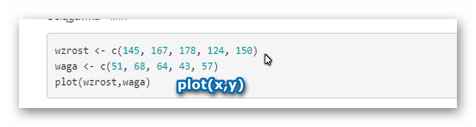
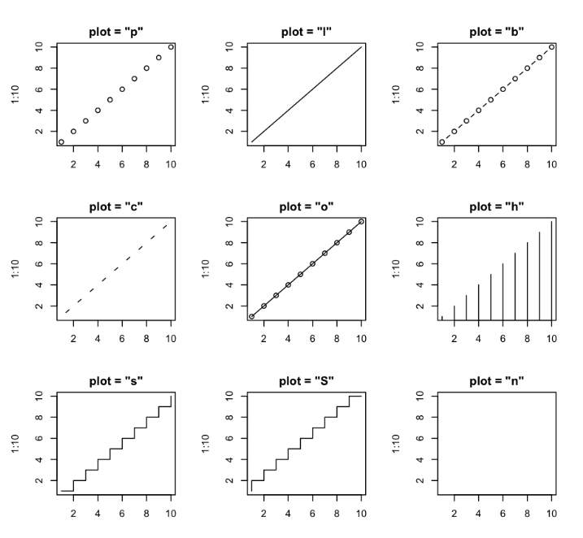
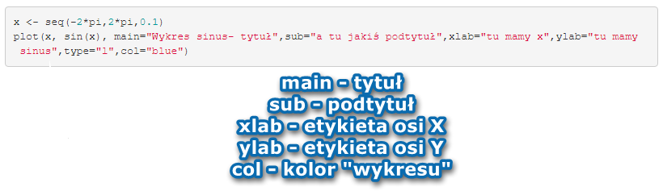

<style type="text/css">
.title {
  display: none;
}

.table {
    width:70%;
}

#getting-started img {
  margin-right: 10px;
}

</style>


# Podstawy

## Wykres - plot

Funkcja `plot` w podstawowej wersji służy do generowania/rysowania wykresów.

Opis w dokumentacji - [link](https://www.rdocumentation.org/packages/graphics/versions/3.5.1/topics/plot)

Ściągawka - [link](http://www.gastonsanchez.com/visually-enforced/resources/2015/09/22/R-cheat-sheet-graphical-parameters/)




```{r}
wzrost <- c(145, 167, 178, 124, 150)
waga <- c(51, 68, 64, 43, 57)
plot(wzrost,waga)
```

Zróbmy linię:

```{r}
wzrost <- c(145, 167, 178, 124, 150)
waga <- c(51, 68, 64, 43, 57)
plot(wzrost,waga, type = "l")
```

Ważne jest uporządkowanie danych.
```{r}
wzrost <- c(124, 145, 150, 167, 178)
waga <- c(43, 51, 57, 68, 64)
plot(wzrost,waga,type = "l")
```

Różne typy do wpisania:



Jeśli chcemy narysować wykres funkcji, to najpierw musi stworzyć wektor argumentów (odciętych).
```{r}
x <- seq(-2*pi,2*pi,0.1)
plot(x, sin(x))
```

Przykład użycia różnych parametrów:



```{r}
x <- seq(-2*pi,2*pi,0.1)
plot(x, sin(x), main="Wykres sinus- tytuł",sub="a tu jakiś podtytuł",xlab="tu mamy x",ylab="tu mamy sinus",type="l",col="blue")
```

```{r}
x <- seq(-2*pi,2*pi,0.1)
plot(x, sin(x),type="l",xlim=c(0,2*pi), ylim=c(-0.5,0.5))
```

Lista wbudowanych kolorów to funkcja `colors()`.
Użycie kolorów w systemie hex możliwe jest poprzez `#AA4371`.
Jeśli mamy wartość rgb, możemy ją zmienić na poprzez polecenie `rgb`.
```{r}
x <- seq(-2*pi,2*pi,0.1)
plot(x, sin(x), col="#AA4371")
```
```{r}
x <- seq(-2*pi,2*pi,0.1)
plot(x, sin(x), col=rgb(34,22,25,max=255))
```

## `Plot` - ćwiczenia

1. Narysuj wykresy przykładowych funkcji, dopisz osie. Poćwicz różne kombinacje.
2. Zrób wykres wybierając dwie kolumny ze zbioru `mtcars`.

## `plot` a jeden wektor

```{r}
x<-c(3,4,5)
plot(x)
```
