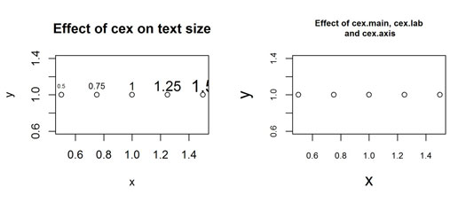

<style type="text/css">
.title {
  display: none;
}

.table {
    width:70%;
}

#getting-started img {
  margin-right: 10px;
}

</style>


## Dodatkowe punkty i teksty

```{r}
x<-c(1,2,3,4,5)
y<-c(3,4,1,0,8)
plot(x,y,type = "l")
text(2,2,labels = "jakiś tekst")
points(3,6,pch=7, cex=2)
```

Objaśnienie `cex`:



```{r}
plot(1, 1, xlim=c(1,5.5), ylim=c(0,7), type="n", ann=FALSE)
text(1:5, rep(6,5), labels=c(0:4), cex=1:5, col=1:5)
points(1:5, rep(5,5), cex=1:5, col=1:5, pch=0:4)
```
