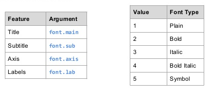
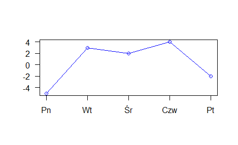

<style type="text/css">
.title {
  display: none;
}

.table {
    width:70%;
}

#getting-started img {
  margin-right: 10px;
}

</style>


# Tytuł


Dodatkowo gdy potrzeba nam bardziej rozbudowanych podpisów możemy użyć funkcji `title` - [link](https://www.rdocumentation.org/packages/graphics/versions/3.5.1/topics/title). Parametry graficzne są opisane [tutaj](https://www.rdocumentation.org/packages/graphics/versions/3.5.1/topics/par).



Przykładowe użycia:
```{r}
cars <- c(1, 3, 6, 4, 9)
plot(cars, type="o", col="blue")
title(main="Samochody", col.main="red", font.main=3)
```

Parametry do czcionek: 1=plain, 2=bold, 3=italic, 4=bold italic, 5=symbol.

```{r}
cars <- c(1, 3, 6, 4, 9)
plot(cars, type="o", col="blue")
title(xlab="Indeksy", col.lab="red")
```

Poprawka:
```{r}
cars <- c(1, 3, 6, 4, 9)
plot(cars, type="o", col="blue", xlab="")
title(xlab="Indeksy", col.lab="red")
```

```{r}
a<-c(1,2,3,4,5,6,7)
b<-c(23,3,2,4,5,2,-2)
plot(a,b,main="Wykres",axes=FALSE,type="o",col="blue",ann=FALSE)
axis(2, las=1, at=10*0:range(b)[2])
axis(1, at=1:7, lab=c("Pn","Wt","Śr","Czw","Pt","So","Nd"))
box()
```

### Tytuł - ćwiczenia

1. Poćwicz samodzielnie różne kombinacje.
2. Spróbuj odwzorować w kodzie poniższy wykres.

